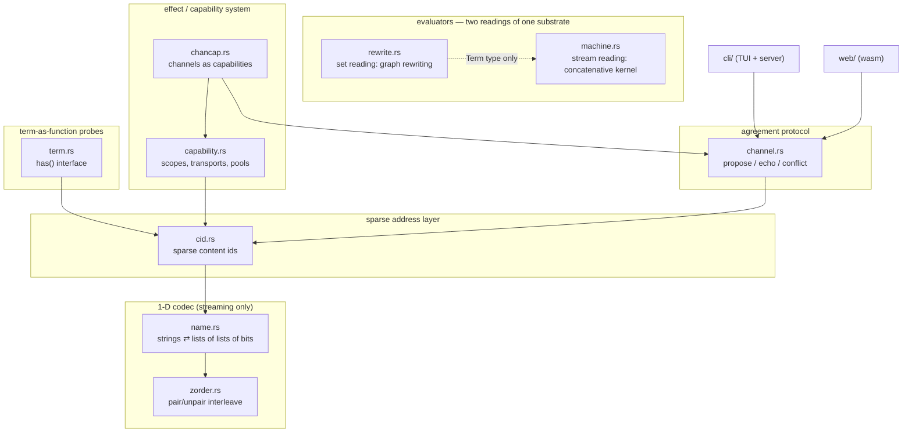
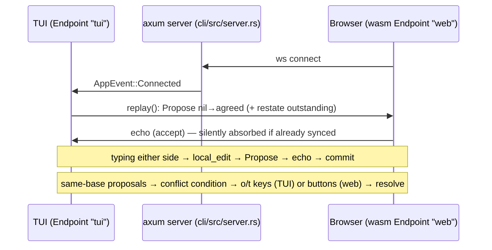

# graphlang-core: complete map at reset (2026-07-18)

Function-level documentation of `rs/core` as it stood before the reset.
Nine modules, 60 passing tests. The `cli/` (TUI + axum server) and `web/`
(wasm client) crates built on `channel` + `cid` and are preserved on disk
but unwired from the workspace.

## Layer diagram



Layering discipline (hard-won, violated four times before being learned):
**semantics lives on sets of pairs; the 1-D bit encoding is a frame,
consulted only at the streaming boundary.** `machine`/`rewrite` never
import `zorder`.

## Conventions ledger (the frozen choices)

- `pair(head, tail)`: head on **odd** bits, tail on **even** bits; nil = 0.
- Edge forms: `(0,a)` = quote (inert, left-empty = not acting);
  `(a,0)` = demand/hole; `(a,a)` = copycat/identity/tag.
- Cut: `(a,b) ∘ (b,c) → (a,c)` through the shared middle.
- Text: one bit-row per char, codepoint bits LSB-first, minimal length.
- Sparse position law: char `i`, bit `j` ⇔ bit `2^i · (2^(j+1)+1)` of the
  packed integer (odd part of any text position is `2^k+1`).
- Chirality (which plane is "real") was deliberately left as a codec
  detail: "wire format v0" = whatever the tests pin.

---

## zorder.rs — the pairing combinator (BigUint)

| fn | signature | does |
|---|---|---|
| `spread` | `(&BigUint) -> BigUint` | bit `k` → bit `2k` |
| `compact` | `(&BigUint) -> BigUint` | inverse: keeps even bits, halves positions |
| `pair` | `(head, tail) -> BigUint` | `spread(head)<<1 \| spread(tail)` |
| `unpair` | `(&BigUint) -> (BigUint, BigUint)` | `(compact(n>>1), compact(n))` |

Tests: roundtrips; `pair(1,0)=2`, `pair(0,1)=1`, `pair(2,0)=8`.

## name.rs — strings ⇄ lists of lists of bits ⇄ one integer

Types: `Bits = Vec<bool>`, `Name = Vec<Bits>`,
`NameError { NotAChar(u64), TooLarge, NotABit, NonCanonical }`.

| fn | does |
|---|---|
| `char_to_bits(char) -> Bits` | codepoint LSB-first, minimal (`'\0'` → `[]`) |
| `bits_to_char(&[bool])` | inverse; empty row = `'\0'` |
| `string_to_name / name_to_string` | map the above over chars |
| `pack_bits(&[bool]) -> BigUint` | cons-fold: `pair(b0, pair(b1, … 0))` |
| `pack(&Name) -> BigUint` | cons-fold of packed rows |
| `unpack_bits / unpack` | walk cons chain to nil; reject non-shrinking tails |
| `encode(&str) / decode(&BigUint)` | conveniences |

Known values: `encode("")=0`, `encode("\u{1}")=8`, `encode("\u{3}")=40`.
Caveats (tested): trailing NULs vanish (nil = 0); width doubles per cons
cell (exponential — why the sparse cid exists); the integer 1 is its own
tail (`NonCanonical`).

## cid.rs — sparse content ids (support of the packed integer)

`Cid(BTreeSet<(u32,u32)>)` — set of `(char-row, bit-col)` coords.
Serde: sorted `Vec<(u32,u32)>` (the wire cid).

| fn | does |
|---|---|
| `from_text / to_text` | text ⇄ coords; rejects NUL (empty row unrepresentable) and row gaps |
| `apply(add, remove) -> Cid` | sparse edit |
| `diff_to(&Cid) -> (add, remove)` | set differences — a diff between texts |
| `position((i,j)) -> BigUint` | the law `2^i · (2^(j+1)+1)` |
| `to_biguint()` | materialize (test-only; exponential) |
| `digest()` | short UI hash `"{bits}b:{fnv:08x}"` |
| `coords / contains / is_empty / empty` | plumbing |

Key test: `cid.to_biguint() == name::pack(...)` — the sparse and packed
views are the same object (the design's tripwire test).

## channel.rs — two-party agreement (the language's channel semantics)

Types: `Diff { base: Cid, add, remove }` (+ `result()`),
`Msg::Propose { diff, actor }` (the **only** wire type; internally-tagged
JSON), `Step { outbound, agreed_changed }`,
`Resolution { Theirs, Ours, Merged(Diff) }`.

`Endpoint { actor, agreed, local, log, outstanding, theirs_pending, dirty }`:

| method | does |
|---|---|
| `new(actor)` | fresh endpoint, agreed = empty |
| `local_edit(text) -> Vec<Msg>` | diff vs agreed → Propose; coalesces (dirty flag) while one is outstanding |
| `receive(Msg) -> Step` | the protocol (rules below) |
| `conflict() -> Option<(&Diff,&Diff)>` | the condition: two proposals, same base |
| `resolve(Resolution) -> Vec<Msg>` | handler outcome → superseding messages |
| `replay() -> Vec<Msg>` | state sync = synthetic proposal nil→agreed + `restate()` |
| `restate() -> Vec<Msg>` | re-send outstanding (reconnects) |
| `agreed_cid / agreed_text / local_text / log` | accessors |

Protocol rules in `receive` (in order):
1. own actor + diff == outstanding → **commit** (echo = acceptance).
2. their diff, base == agreed, no outstanding → **accept**: apply + echo verbatim.
3. their diff, base == agreed, outstanding → **conflict condition** (no reply).
4. their base == our outstanding's result → raced accept: commit ours, re-process theirs.
5. their result == our agreed → **silent absorb** (makes replay idempotent, kills loops).
6. otherwise → **divergence conflict**: synthesize ours = "their base → our agreed" (cids decode, so always computable); no automatic reply.

Conflict is a *condition*, never a message. Verdicts are learned by
reading. Tests: convergence, coalescing, conflict+resolve (all three
resolutions), replay sync, divergence both ways, wire-format roundtrip.

## term.rs — terms as characteristic functions

`trait Term { has(&self, index: &dyn Term) -> bool; extent() -> Option<u64> }`
— **indices are themselves terms**; `value_of` reads one via `Nat` probes
(terminates by log-collapse of bit-length).

Implementors (each a *query transform*, no bits materialized):

| type | semantics |
|---|---|
| `Nat(u64)` / `Zero` / `Ones` | literals; `Ones` = −1 = lattice top |
| `Sparse(BTreeSet<u64>)` | stored support; `From<&Cid>` via `edge_index(left,right)` (left odd / right even) |
| `Real<T>` / `Imag<T>` | plane split of the value: bit k = inner bit 2k / 2k+1 |
| `Pair<H,T>` | reassemble; `{head:Zero,…}` = quote, `{…,tail:Zero}` = demand |
| `TwosComplement<T>` | lazy negation via cached valuation; −0 = 0; extent None (infinite tail) |
| `RotateI<T>` | ×i: new re = −im, new im = re. Tested: `i·quote(a) = demand(a)` (= ×2), `i⁴ = id`, `i²` = plane-wise negation ≠ integer 2's complement |
| `Periodic(Vec<bool>)` / `WithTail` | eventually-periodic = rational 2-adics (1/3 tested: 3·(1/3)=1 with infinite carries) |
| `Add<A,B>` | full carry propagation, O(k)/query; `Ones + 1 = 0` (carry escapes to infinity) |
| `Complement / Union / Intersect` | Boolean algebra (De Morgan tested) |

## capability.rs — scopes, transports, resources

Types: `CapName = Cid`, `Payload = Cid`,
`CapError { Unhandled, NotExecutable, HandlerFailed, SessionViolation, CompositeIncomplete, NotComposite, NotAPool, InsufficientCapacity{requested,available}, UnknownLease }`,
`Session { mask: Option<Cid>, may_propose }` (`admits` = coord subset test),
`Interface { members: BTreeMap<CapName, Session> }`,
`PurityTier: Host < External < Sandboxed < Pure`,
`Lease { pool, id, amount }` — **no Clone: settling moves it (affine)**.

`Transport`: `Host(FnMut)` · `File{path,writable}` ·
`Network{addr, peer_public_key}` · `Wasm{module: Cid}` · `Pure{term: Cid}`
· `Composite{members: BTreeMap<CapName, Registration>}` ·
`Pool{available, next_lease, outstanding}`.
`purity()`: composite = min of members; pool = Sandboxed.

`Scopes` (stack of `Scope`; innermost shadows):

| method | does |
|---|---|
| `push / pop / register` | scope discipline; register = declaration edge (name, session, transport) |
| `resolve(name)` | walk outward (effect propagation) |
| `register_composite(parent, Interface, handlers)` | exact-coverage check both directions |
| `invoke_path(&[names], payload)` | resolve head outward, descend composites, session-check, execute |
| `invoke(name, payload)` | single-name convenience |
| `deposit / reserve(n)→Lease / consume(Lease) / release(Lease) / balance` | linear resources; reserve fails with actual capacity |

Execution: `Host` runs; `File` read→text-cid / write-if-writable;
`Network/Wasm/Pure` resolve but don't execute (descriptors for later
layers); bare `Composite`/`Pool` refuse with instructions.

## chancap.rs — channels as composite capabilities

`ChannelState { endpoint, outbox }`, `SharedChannel = Arc<Mutex<…>>`,
`new_channel(actor)`, `register_channel(scopes, name, chan)`.

Members (one composite, both ends dual): `read` (agreed text) ·
`propose` (payload = target text → local_edit → outbox) ·
`commit` (drain outbox → serialized batch **as a term**) ·
`receive` (batch term → receive each → returns new agreed) ·
`accept` (resolve Theirs) · `reject` (resolve Ours) ·
`counter` (payload text → Merged diff on the conflict's base).
Tests: propose/commit/receive/read happy path; conflict + accept;
counterproposal supersedes (both converge on the merge).

## machine.rs — evaluator, stream reading (concatenative kernel)

`Term(BTreeSet<(Term,Term)>)` — the only data structure, but used as
lists: `cons(h,t) = {(h,t)}` singleton chains.
Constructors: `nil, cons, num(k)` (quote-tower numerals),
`lit(v) = {(nil,v)}` (left-empty = push), `op(k) = {(k̂,nil)}` (demand =
instruction), `list`, `append`, `split/pop/numeral_value`.

`run(code, stack)`: 8 rules — push, `DUP=1, DROP=2, SWAP=3, CAT=4`
(append), `AP=5` (unquote-and-run), `UNIT=6` (wrap in quotation),
`DIP=7` (run under top). Step limit 100k.

Booleans: `TRUE=[SWAP,DROP,AP]`, `FALSE=[DROP,AP]` (selectors);
`not_frag/and_frag/or_frag` via `select_frag` (DIP the branch pair
underneath). SKI as macros (call-by-name thunks:
`app(f,x) = [lit x] ++ f ++ [AP]`, `atom(p) = [lit p]`):
`i_prog() = nil` (**I is the empty set**), `k_prog()` = 4 ops
(UNIT, lit[DROP], SWAP, CAT), `s_prog()` = 15 ops (two-stage list
surgery), `value(thunk)`. Tests: truth tables, `K a b = a`,
`S K K x = x = I x`, `S K I z = z`.

## rewrite.rs — evaluator, set reading (native graph rewriting)

Shares `machine::Term`. Nodes are sets of 2-tuples; expressions are
2-tuples of nodes; **no lists, no program counter**.

| fn | does |
|---|---|
| `slot(k) = {(k̂,k̂)}` | variables as diagonal tags |
| `tmpl(n, body) = {(n̂, body)}` | function node; left numeral = remaining arity |
| `app(f,x) = {(f,x)}` | application = the expression pair |
| `as_template` | `{(n̂,b)}`, n≥1, b≠n̂ (diagonals are slots, not callable) |
| `subst(t, slot, x)` | structural replace; **stops at function nodes** (binders own their slots; inner combinators must be closed) **and quote-edges** `{(nil,a)}` |
| `eval` | normalize edge-wise (unordered = native parallelism); singleton `(F,X)` with template F binds `slot(n) := X`, arity counts down, saturation releases the body; depth limit 512 |

Encodings: `I={(1̂,σ₁)}`, `K=TRUE={(2̂,σ₂)}`, `FALSE={(2̂,σ₁)}`,
`S={(3̂,(σ₃·σ₁)·(σ₂·σ₁))}`, `NOT=λb.b·F·T`, `AND=λab.a·b·F`,
`OR=λab.a·T·b`. Tests: I, K, `S K K x = x`, `S K I z = z`, full truth
tables, direct selection `TRUE·x·y = x`.

**machine vs rewrite** = the time-like vs space-like readings of one
substrate: machine avoids substitution by paying with sequential lists;
rewrite buys direct S/K by paying with substitution. Their merge point
(substitution as streamed diffs over a channel) was the next milestone.

---

## The running app (cli + web, preserved but unwired)



- `cli/src/main.rs`: clap args (`--port` 7341), server thread + TUI thread, `ClientHandle = Arc<Mutex<Option<UnboundedSender<String>>>>`.
- `cli/src/server.rs`: serves embedded wasm assets, `/ws` bridge, one client at a time.
- `cli/src/tui.rs`: ratatui — input line, agreed pane + cid digest, channel log, modal conflict prompt (`o`/`t`), Esc quits.
- `web/src/lib.rs`: `#[wasm_bindgen] Client(Endpoint)` — `local_edit/receive/conflict/resolve/agreed_text/local_text/agreed_digest`, JSON strings in/out.
- `web/static/`: index.html + app.js (textarea ⇄ ws ⇄ wasm).
- `rs/build-web.sh`: cargo wasm build + wasm-bindgen (CLI pinned `=0.2.104`) → `cli/assets/` (gitignored).

## Invariants worth re-pinning in any rebuild

1. `Cid::to_biguint() == name::pack()` — sparse support ⇔ packed integer.
2. `i·quote(a) = demand(a)` (finite, = ×2); `i⁴ = id`; `i²` = plane-wise
   negation ≠ integer 2's complement (carries cross planes).
3. Replay is idempotent (result == agreed → silent absorb) — no sync loops.
4. Conflict is a condition, not a message; divergence never auto-replies.
5. Composite registration covers its interface exactly, both directions.
6. Leases are affine (host move semantics); reserve reports real capacity.
7. `I` is the empty set; left-empty is inert in *both* evaluators.
8. Substitution never crosses a binder or a quote.
```
